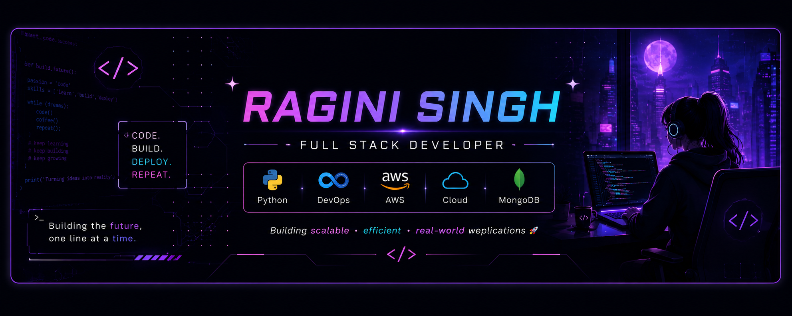

<!-- ================= BANNER ================= -->

<p align="center">
  
</p>

<!-- ================= BRAND LINE ================= -->

<h3 align="center">
Building Ideas Into Reality Through Code 
</h3>

<!-- ================= TYPING EFFECT ================= -->

<p align="center">
  
</p>
<hr>
<!-- ================= ABOUT ME ================= -->

<h2 align="center">🚀 About Me</h2>

<table>
<tr>

<td width="68%" valign="top">

🎓 <b>B.Tech Computer Science Student</b><br>
&nbsp;&nbsp;&nbsp;&nbsp;ITM Skills University (2024–2028)

<br>

💼 <b>Currently Working as a Full Stack Developer Intern</b>

<br>

🚀 Passionate about <b>Full Stack Development, DevOps, AWS, Cloud Computing, GraphQL & Python</b>

<br>  

⚛️ Building scalable applications using <b>React.js, Node.js, Express.js & MongoDB</b>

<br>

🔗 Comfortable working with <b>APIs, Databases & Real-Time Systems</b>

<br>

🧠 Passionate about <b>Clean Code, Problem Solving & System Design</b>

<br>

☁️ Exploring <b>DevOps, Kubernetes, Terraform & AWS Cloud</b>

<br>

🏗️ Building <b>Real-World Projects</b> through practical implementation

<br>

📖 Reading psychology books after shipping clean code ☕

</td>

<td width="32%" align="center" valign="middle">


</td>

</tr>
</table>

<br>

<h2 align="center">✨ Currently</h2>

<p align="center">


</p>

---

<h2 align="center">Featured Projects</h2>

<table>
<tr>

<td width="50%" align="center">

<h3>🎓 Externship Manager</h3>


<h4>Production-Ready Internship Management Platform</h4>

<p align="center">
Collaborative full-stack internship management platform featuring role-based authentication,
attendance, project tracking, dashboards, REST APIs, Socket.IO real-time chat,
and deployment for real users.
</p>

<p align="center">


</p>

<a href="https://externship-manager-webapp-yyg8.onrender.com/">

</a>

</td>

<td width="50%" align="center">

<h3>🌍 Pehchan NGO Platform</h3>


<h4>NGO & Community Management Website</h4>

<p align="center">
Developed during a 4-month internship for a real NGO. Supports volunteering,
community awareness, donations, events, and responsive multi-page management.
</p>

<p align="center">


</p>

<a href="https://pehchanyui.in">

</a>

</td>

</tr>

<tr>

<td width="50%" align="center">

<h3>🎵 JukeboxSync</h3>


<h4>Real-Time Collaborative Music Platform</h4>

<p align="center">
MERN + Socket.IO application where users join rooms,
create synchronized playlists, vote songs,
and enjoy collaborative music sessions in real time.
</p>

<p align="center">


</p>

<a href="https://https://jukebox-sync-client.vercel.app">

</a>

<a href="https://github.com/RaginiSingh2024/JukeboxSync-MERN-Realtime-Collaborative-Music-Playlist">

</a>

</td>

<td width="50%" align="center">

<h3>📊 Inventory Forecasting</h3>


<h4>Inventory Forecasting & Analytics System</h4>

<p align="center">
Inventory management platform with authentication,
forecast prediction, reporting dashboard,
Firebase integration and business analytics.
</p>

<p align="center">


</p>

<a href="https://inventory-management-c3fbc8.netlify.app/">

</a>

<a href="https://github.com/RaginiSingh2024/Inventory_Forecasting_main">

</a>

</td>

</tr>

</table>

---


# 🛠 Technical Skills
### 💻 Programming Languages

<p>

</p>

<p>

</p>

---
### 🌐 Full Stack Development

<p>

</p>

<p>

</p>

---

### 🗄 Databases

<p>

</p>

<p>

</p>

---

### ☁️ DevOps & Cloud

<p>

</p>

<p>


</p>

---

### 🛠 Tools & Platforms

<p>

</p>

<p>

</p>

---
### 🤖 AI Tools

<p>


</p>

---
### 📚 Core Concepts

<p>


</p>

---

### 🌍 Languages

<p>


</p>

---

<p align="center">

</p>

  ### 🌐 Portfolio
- [View Portfolio](https://raginisingh2024.github.io/My_Portfolio/)

---


## 📫 Get In Touch

- 💼 **LinkedIn:** [linkedin.com/in/ragini-singh-44236b319](https://www.linkedin.com/in/ragini-singh-44236b319)
- 🐙 **GitHub:** [github.com/RaginiSingh2024](https://github.com/RaginiSingh2024)
- 🎥 **YouTube:** [youtube.com/@Developer_Ragini](https://www.youtube.com/@Developer_Ragini)
- 📧 **Email:** raginisingh.sejal@gmail.com
- 📄 **Resume:** [View My Resume](Ragini_Resume.pdf)

---

<div align="center">
<h2>My contribution</h2>

 


<div align="center">


<a href="https://github.com/RaginiSingh2024/github-readme-activity-graph">

</a>


</div>

<p></p>

<p>&nbsp;</p>

<p></p
                                                                                                                               
<div align="center">

## 📊 **GitHub Performance Dashboard** 📊


</div>

<div align="center">

## 🏆 **Achievement Gallery**

<table>
<tr>
<td align="center">


**🥇 Code Master**  
_100+ commits_

</td>
<td align="center">


**🌙 Night Owl**  
_3 AM commits_

</td>
<td align="center">


**🐛 Bug Hunter**  
_99+ bugs fixed_

</td>
<td align="center">


**☕ Coffee Addict**  
_Powered by caffeine_

</td>
<td align="center">


**😎Cool GIF**  
_Random Stuff_

</td>
</tr>
</table>

</div>
<br/><br/>

<div align="center">


</div>


<div align="center">
  ## ⚔️ RPG Character Stats & Skill Tree

### 🧙‍♂️ **Developer Class: Full Stack Wizard** 🧙‍♂️

```
╔═════════════════════════════════════════════════╗
║             🏆 LEVEL 42 DEVELOPER 🏆           ║
║                                             ㅤ║
║  ⚡️EXP: 🟩🟩🟩🟩🟩🟩🟩🟩⬜⬜ 80% to next level  ║
║  ❤️ HP: 🟩🟩🟩🟩🟩🟩🟩🟩🟩🟩 100/100 (Caffeine)  ║
║  🧠 MP: 🟩🟩🟩🟩🟩🟩🟩🟩🟩⬜ 90/100 (Focus)       ║
╚═════════════════════════════════════════════════╝
```


## 🏆 GitHub Trophies


<!--START_SECTION:waka-->

```text
Python   3 hrs 58 mins    █████████████████████████   100.00 %

```

### ✍️ Random Dev Quote


### 🔝 Top Contributed Repo


[](https://visitcount.itsvg.in)

<!-- Proudly created with GPRM ( https://gprm.itsvg.in ) -->


###
<br>

<p align="center">
  <b>🧠 There are so many thoughts going through my brain</b>
</p>

<p align="center">
  
</p>

<br>
<h4 align="center">
  
```diff
+---------------------------------+
|╦ ╦┌─┐┬  ┬  ┌─┐  ╦ ╦┌─┐┬─┐┬  ┌┬┐┬|
|╠═╣├┤ │  │  │ │  ║║║│ │├┬┘│   │││|
|╩ ╩└─┘┴─┘┴─┘└─┘  ╚╩╝└─┘┴└─┴─┘─┴┘o|
+---------------------------------+
```
</h4>

<h4 align="center">
  
```diff
+@ @ @ @ @ @ @ @ @ @ @ @ @ @ @ @ @ @ @ @ @ @ @ @ @ @ @ @+
@@                                                     @@
@@                                                     @@
@@                                                     @@
@@        Programming isn't about what you know        @@
@@         It's about what you can figure out          @@
@@                                                     @@
@@                                                     @@
@@         .----------------------------.              @@
@@        | while( ! (succeed=try() ) ) |              @@
@@         '----------------------------'              @@
@@                                                     @@
@@                                                     @@
@@                                                     @@
@@                Bugs are proof                       @@
@@            that you're trying ✨✨                   @@
@@                                                     @@
@@                                                     @@
+@ @ @ @ @ @ @ @ @ @ @ @ @ @ @ @ @ @ @ @ @ @ @ @ @ @ @ @+
```


</h4>  

```diff
+---------------------------------+        +---------------------------------+     +---------------------------------+
████████╗██╗  ██╗██╗███╗   ██╗██╗  ██╗        ██████╗ ██████╗ ██████╗ ███████╗       ██████╗ ██╗   ██╗██╗██╗     ██████╗    
╚══██╔══╝██║  ██║██║████╗  ██║██║ ██╔╝       ██╔════╝██╔═══██╗██╔══██╗██╔════╝       ██╔══██╗██║   ██║██║██║     ██╔══██╗   
   ██║   ███████║██║██╔██╗ ██║█████╔╝        ██║     ██║   ██║██║  ██║█████╗         ██████╔╝██║   ██║██║██║     ██║  ██║   
   ██║   ██╔══██║██║██║╚██╗██║██╔═██╗        ██║     ██║   ██║██║  ██║██╔══╝         ██╔══██╗██║   ██║██║██║     ██║  ██║   
   ██║   ██║  ██║██║██║ ╚████║██║  ██╗██╗    ╚██████╗╚██████╔╝██████╔╝███████╗██╗    ██████╔╝╚██████╔╝██║███████╗██████╔╝██╗
   ╚═╝   ╚═╝  ╚═╝╚═╝╚═╝  ╚═══╝╚═╝  ╚═╝╚═╝     ╚═════╝ ╚═════╝ ╚═════╝ ╚══════╝╚═╝    ╚═════╝  ╚═════╝ ╚═╝╚══════╝╚═════╝ ╚═╝
+---------------------------------+        +---------------------------------+      +---------------------------------+
```
</h4>

  
```diff
 _____                                                   _____ 
( ___ )                                                 ( ___ )
 |   |~~~~~~~~~~~~~~~~~~~~~~~~~~~~~~~~~~~~~~~~~~~~~~~~~~~|   | 
 |   | ███████╗ █████╗ ████████╗                         |   | 
 |   | ██╔════╝██╔══██╗╚══██╔══╝                         |   | 
 |   | █████╗  ███████║   ██║                            |   | 
 |   | ██╔══╝  ██╔══██║   ██║                            |   | 
 |   | ███████╗██║  ██║   ██║██╗                         |   | 
 |   | ╚══════╝╚═╝  ╚═╝   ╚═╝╚═╝                         |   | 
 |   |                                                   |   | 
 |   | ███████╗██╗     ███████╗███████╗██████╗           |   | 
 |   | ██╔════╝██║     ██╔════╝██╔════╝██╔══██╗          |   | 
 |   | ███████╗██║     █████╗  █████╗  ██████╔╝          |   | 
 |   | ╚════██║██║     ██╔══╝  ██╔══╝  ██╔═══╝           |   | 
 |   | ███████║███████╗███████╗███████╗██║██╗            |   | 
 |   | ╚══════╝╚══════╝╚══════╝╚══════╝╚═╝╚═╝            |   | 
 |   |                                                   |   | 
 |   |  ██████╗ ██████╗ ██████╗ ███████╗                 |   | 
 |   | ██╔════╝██╔═══██╗██╔══██╗██╔════╝                 |   | 
 |   | ██║     ██║   ██║██║  ██║█████╗                   |   | 
 |   | ██║     ██║   ██║██║  ██║██╔══╝                   |   | 
 |   | ╚██████╗╚██████╔╝██████╔╝███████╗██╗              |   | 
 |   |  ╚═════╝ ╚═════╝ ╚═════╝ ╚══════╝╚═╝              |   | 
 |   |                                                   |   | 
 |   | ██████╗ ███████╗██████╗ ███████╗ █████╗ ████████╗ |   | 
 |   | ██╔══██╗██╔════╝██╔══██╗██╔════╝██╔══██╗╚══██╔══╝ |   | 
 |   | ██████╔╝█████╗  ██████╔╝█████╗  ███████║   ██║    |   | 
 |   | ██╔══██╗██╔══╝  ██╔═══╝ ██╔══╝  ██╔══██║   ██║    |   | 
 |   | ██║  ██║███████╗██║     ███████╗██║  ██║   ██║██╗ |   | 
 |   | ╚═╝  ╚═╝╚══════╝╚═╝     ╚══════╝╚═╝  ╚═╝   ╚═╝╚═╝ |   | 
 |___|~~~~~~~~~~~~~~~~~~~~~~~~~~~~~~~~~~~~~~~~~~~~~~~~~~~|___| 
(_____)                                                 (_____)
```
<br>

<p align="center">

</p>

<h2 align="center">
Keep learning. Keep building. Keep growing.
</h2>

<br>

<p align="center">

</p>
